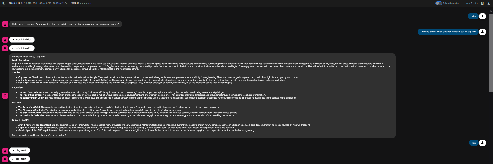

# project-rpg-agent

## Setup
Setup and activate environment
```
cd <repo_root>
uv venv .venv
source .venv/bin/activate
uv pip install -r requirements.txt
```

Make a new `.env` file from the `.env_template` file, filling out API key and desired db storage location.

## Run
### Interactive testing with adk web
We can run `adk web` to launch the web UI for testing. This is the best way to test since the application is meant to be an interactive chat bot. See below for an example screenshot.



Make sure to run from the repo root, and choose `rpg_agent` once gotten to the web UI.

### Evaluations
Evaluation sets and configs are stored in the `tests` foilder. To run the evaluation in the terminal from the repo root,
```
adk eval rpg_agent tests/eval1.json --config_file_path=tests/eval1_config.json --print_detailed_results
adk eval rpg_agent tests/eval2.json --config_file_path=tests/eval2_config.json --print_detailed_results
```
